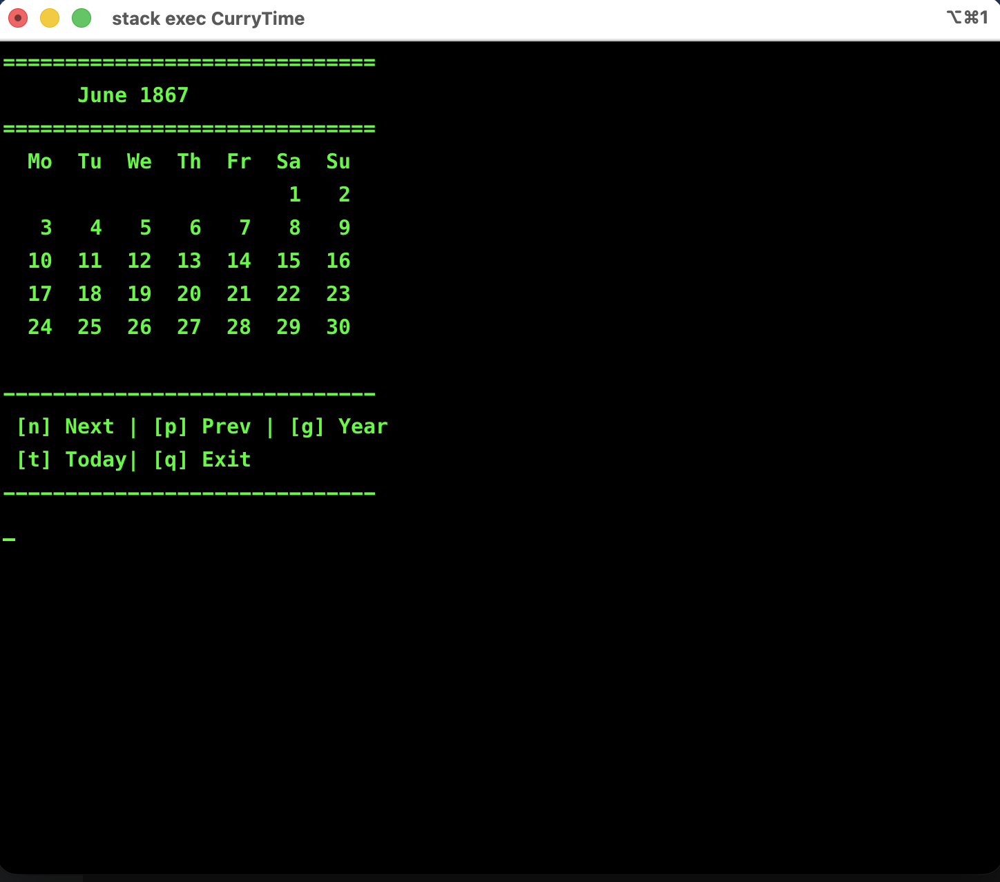

# CurryTime

A minimalist, high-precision CLI calendar written in Haskell. Unlike standard system calendars, **CurryTime** uses the Proleptic Gregorian calendar, allowing you to explore dates far into the past (like 1867) or the distant future with mathematical certainty.

---

## 🚀 Features

- **Historical Accuracy**: Navigate dates way before the Unix Epoch (1970).
- **Interactive Navigation**: Move through months and years using simple keystrokes.
- **Purely Functional**: Built with Haskell's `Data.Time` library for robust date arithmetic.
- **Zero Dependencies**: Uses only standard Haskell libraries.

---

## Navigation Keys

Once the program is running, use the following keys:

| Key | Action |
|-----|--------|
| `n` | Go to the **Next** month |
| `p` | Go to the **Previous** month |
| `g` | **Go** to a specific year (prompts for input) |
| `t` | Return to **Today's** date |
| `q` | **Quit** the application |

---

## 💻 Installation & Running

### Prerequisites

- [Stack](https://docs.haskellstack.org/en/stable/install_and_upgrade/)

### Build and Execute
1. Clone the repository
   ```bash
   git clone https://github.com/lucadani7/CurryTime
   cd CurryTime
   ```
2. Build the project:
   ```bash
   stack build
   ```
3. Run the calendar:
   ```bash
   stack exec CurryTime
   ```
---

## Why Haskell?
- Most programming languages, such as C, Python, JavaScript, represent time as seconds passed since January 1st, 1970. This makes handling historical dates (like the execution of Emperor Maximilian I of Mexico in 1867) or very distant future dates prone to errors or overflow.
- CurryTime leverages Haskell's arbitrary-precision integers and the Modified Julian Day system to ensure that Wednesday, June 19th, 1867, remains a Wednesday, no matter what your OS thinks!

---

## Behind the Name

The name **CurryTime** is a dual tribute:
1. **Haskell Curry**: The American logician and mathematician whose work in combinatory logic provides the foundation for functional programming and after whom the **Haskell** language is named.
2. **Currying**: A core technique in functional programming where a function with multiple arguments is transformed into a sequence of functions, each with a single argument. 

Just as *currying* breaks down complex logic into simpler, predictable steps, **CurryTime** breaks down the vast axis of time into a precise, mathematically sound calendar.

---

## 📄 License

This project is licensed under the Apache-2.0 License.
